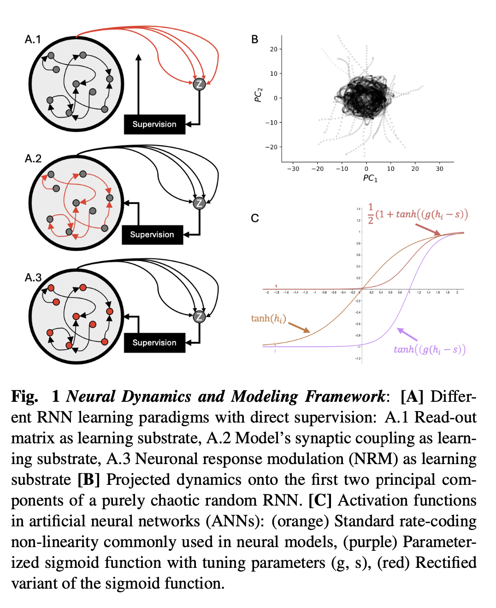

Neural systems exhibit complex dynamics arising from billions of interconnected neurons. While artificial neural networks (ANNs) have been widely used to model such dynamics, they often fall short in terms of biological realism, learning stability, and integration with experimental data. In this study, we explore neuronal response modulation (NRM) as a learning mechanism within a random recurrent neural network (RNN) framework. 

To assess the stability of our networks, we analyzed their Lyapunov spectra. First, we compared the dynamics of random recurrent networks where either the synaptic weights or the neuronal responses were randomly sampled. Next, we evaluated how efficiently each approach could steer the system toward specific dynamics. Finally, we applied neuronal response modulation to a biologically relevant network based on the Drosophila melanogaster connectome. Our results demonstrate the potential of this approach to advance both neuroscience modeling and AI applications.
  

### <ins>References</ins>:
- [Thomas Miconi, “Biologically plausible learning in recurrent neural networks reproduces neural dynamics observed during cognitive tasks”](https://elifesciences.org/articles/20899)  
- [H. Sompolinsky, A. Crisanti, and H. J. Sommers, “Chaos in Random Neural Networks”]( https://link.aps.org/doi/10.1103/PhysRevLett.61.259)  
- [R. Engelken, F. Wolf, and L. F. Abbott, “Lyapunov spectra of chaotic recurrent neural networks”]( https://link.aps.org/doi/10.1103/PhysRevResearch.5.043044)  

### <ins>Supervision</ins>:  
- Kristofer Bouchard - LBNL,  UC Berkeley 
- Alexander Mathis - EPFL 
