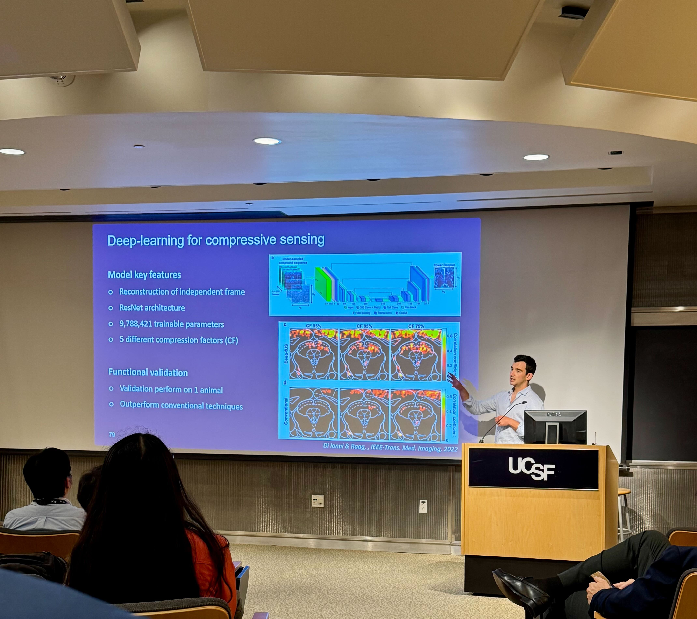

Our work has been selected for presentation at the International Ultrasound Symposium (IUS) 2025 as well as at the UCSF Imaging Research Symposium. We are excited to share our latest advancements in functional ultrasound imaging and deep learning techniques with the broader scientific community.

