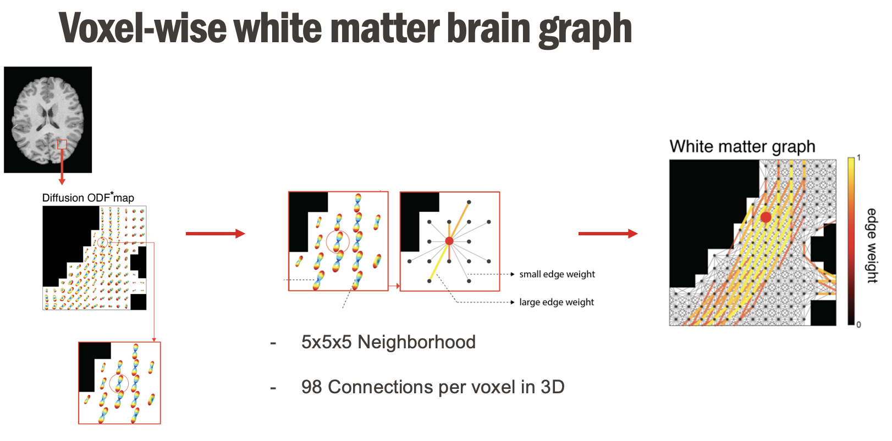
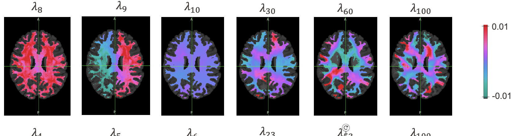

[Abramian et al.](https://www.sciencedirect.com/science/article/pii/S1053811921003724?via%3Dihub) proposed a graph-based representation of brain white matter (WM) that captures the underlying anisotropy observed in WM using diffusion-weighted MRI data. Leveraging this method, we aimed to create a white matter atlas using voxel-wise white matter brain graphs derived from dMRI data.

Once those graphs extracted, we applied spectral clustering to these them to obtain a parcellation of white matter. The strength of this approach lies in its ability to generate parcellations at both individual and population levels.

  

### <ins>References</ins>:
- [D. Abramian, M. Larsson, A. Eklund, I. Aganj, C. Westin, H. Behjat, “Diffusion-informed spatial smoothing of fMRI data in white matter using spectral graph filters”](https://www.sciencedirect.com/science/article/pii/S1053811921003724?via%3Dihub)  
- [K. H. Maier-Hein et al., “The challenge of mapping the human connectome based on diffusion tractography”](https://www.nature.com/articles/s41467-017-01285-x)  
- [A. Ortega, P. Frossard, J. Kovačević, J. M. F. Moura, and P. Vandergheynst, “Graph Signal Processing: Overview, Challenges, and Applications”](https://ieeexplore.ieee.org/document/8347162)  

### <ins>Supervision</ins>:  
- Hamid Behjat - EPFL  
- Andrea Santoro - EPFL  
