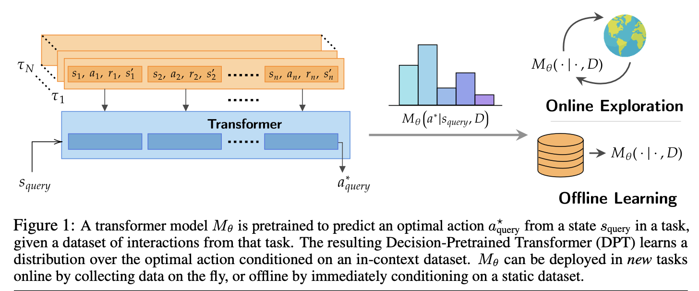
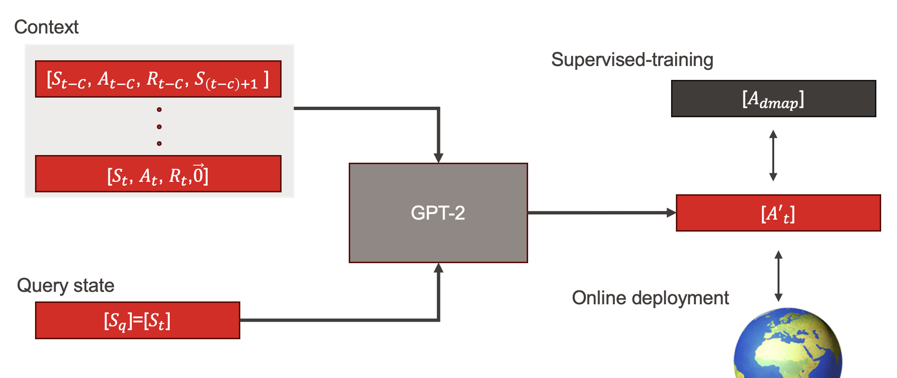

Transformer models have revolutionized the scientific landscape, rapidly surpassing traditional architectures across fields like computer vision, natural language processing (NLP), and audio processing.

This architecture enables scaling up the data available to models during training, resulting in emergent behaviors. One such behavior is in-context learning (ICL) ([Brown et al., 2020](https://arxiv.org/pdf/2005.14165)). ICL allows models to address new tasks by integrating task demonstrations directly into the prompt, eliminating the need for fine-tuning.

Recently, ICL has been extended beyond NLP to other fields, such as [dynamical systems prediction](https://arxiv.org/pdf/2308.08536). Meanwhile, Transformer-based models have also shown promising results in [reinforcement learning setups](https://arxiv.org/pdf/2106.01345).

In this project, we explore ICL for complex Markov Decision Processes (MDPs). Specifically, we investigate whether Transformer-based policies can extract relevant information from their context to solve locomotion tasks.

### <ins>Technical details</ins>:
We trained a GPT-2-based policy in a supervised manner using the [Open Gym framework](https://www.gymlibrary.dev/index.html). During training, we exposed the model to a set of morphologies sampled from a specific perturbation space. This approach, inspired by the work of [Chiappa et al.](https://arxiv.org/pdf/2209.14218), allowed us to test our policy under various perturbations, simulating the concept of new tasks in our setup.

### <ins>References</ins>:
- [A. S. Chiappa, A. M. Vargas, and A. Mathis, “DMAP: A Distributed Morphological Attention Policy for Learning to Locomote with a Changing Body”](https://arxiv.org/pdf/2209.14218)
- [A. Vaswani et al., “Attention is All You Need”](https://arxiv.org/pdf/1706.03762)
- [J. N. Lee et al., “Supervised Pretraining Can Learn In-Context Reinforcement Learning”](http://arxiv.org/abs/2306.14892)
- [H. Balim, Z. Du, S. Oymak, and N. Ozay, “Can Transformers Learn Optimal Filtering for Unknown Systems?”](http://arxiv.org/abs/2308.08536)

### <ins>Supervision</ins>:
- Alberto Chiappa - EPFL
- Adriana Rotondo - EPFL
