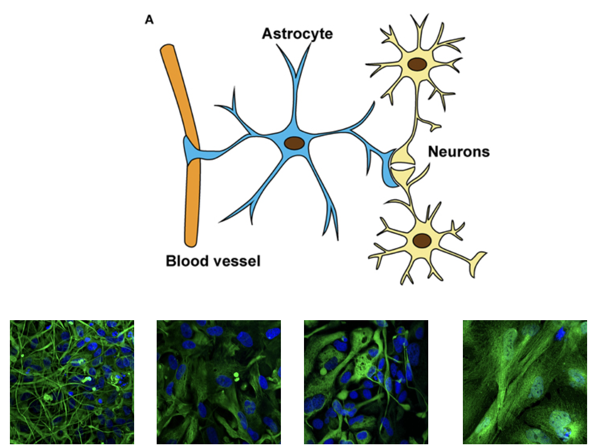
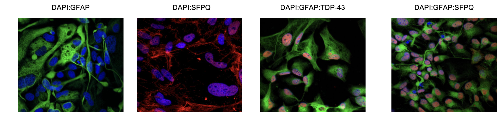

Astrocytes are star-shaped glial cells found in the brain and spinal cord, performing numerous essential functions in the central nervous system, such as providing structural support for neurons, maintaining the extracellular environment, and managing the blood-brain barrier. Different astrocytes can display vastly distinct morphologies. Astrocytes also exhibit various functional states in response to signals, notably the A1 and A2 states: A1 astrocytes are pro-inflammatory, often damaging tissue in cases like brain injury, while A2 astrocytes support repair and regeneration.

In amyotrophic lateral sclerosis (ALS), astrocytes often enter a pro-inflammatory state similar to A1, releasing molecules that exacerbate motor neuron damage. Their impaired ability to repair and regenerate tissue may contribute to ALS progression. This project builds on Doaa M. Taha's research, exploring the link between the morphological and functional states of astrocytes by leveraging in the context of ALS. The project's aim was to utilize AI tools for biological hypothesis testing.

### <ins>Technical Details</ins>
We  used fluorescence microscopy images from iPSC-derived astrocytes taken from both healthy donors and familial ALS patients. These cell cultures were fixed and then immunostained with a combination of three markers: **DAPI**: A nuclear-specific marker, **GFAP**: Outlines intermediate filaments, **Antibody Markers**: Against TDP-43, SPFQ, FUS, or NONO

Combining these markers allowed us to generate images in which the amount information about cellular structures and functions is fixed by our design choice. Using this data, we developed and trained convolutional image classifiers for specific task. Each model was trained using different input channels, allowing us to analyze the unique contributions of each channel to the task at hand.

By comparing the performance of these models on a specific task, we extrapolated the importance of each input channel for that task.

### <ins>References</ins>
- [C. Verzat, J. Harley, R. Patani, and R. Luisier, “Image-based deep learning reveals the responses of human motor neurons to stress and VCP-related ALS”](https://onlinelibrary.wiley.com/doi/pdf/10.1111/nan.12770)
- [O. Russakovsky et al., “ImageNet Large Scale Visual Recognition Challenge”](http://arxiv.org/abs/1409.0575)
- [Doaa M Taha et al. “Astrocytes display cell-autonomous and diverse early reactive states in familial amyotrophic lateral sclerosis”](https://academic.oup.com/brain/article/145/2/481/6510848)
- [Carole Escartin et al., “Reactive astrocyte nomenclature, definitions, and future directions”](https://www.nature.com/articles/s41593-020-00783-4)

### <ins>Supervision</ins>
- Raphaëlle Luisier - IDIAP
