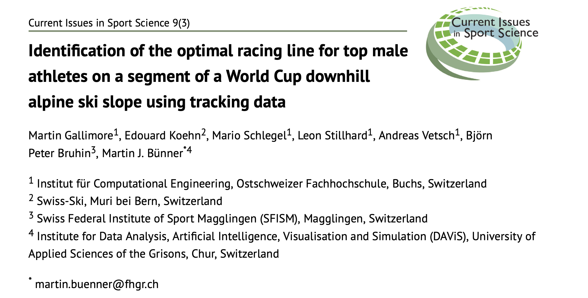

During my internship at the Swiss Ski Federation, we worked on using Global Navigation Satellite System (GNSS) tracking data for performance analysis in winter sports. 
In this context, we applied GNSS technology to various case studies and disciplines, including ski-cross, cross-country skiing, and alpine skiing. This [paper](https://www.semanticscholar.org/paper/Identification-of-the-optimal-racing-line-for-top-a-Gallimore-Koehn/b513b7de53b82d7430b6324abf50bd5a1ba402a7) highlights one of the analyses conducted during the winter of 2020.

